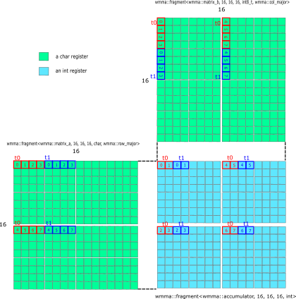

# CUDA-INT8-GEMM
## Introduction
The 8-bit GEMM takes two 8-bit input matrices and produces an output matrix which is also of 8-bit.  

C = A*B^T

We adopt the same convention as the cuBLAS library, where the matrices are stored in column-major order. `GEMM_OP_T` means the matrix is transposed in column-major representation, which is equivalent to the non-transposed matrix in row-major representation. `GEMM_OP_N` means the matrix is not transposed in column-major representation, which is equivalent to the transposed matrix in row-major representation. The same convention applies to matrix C.

You may undersand the `T` and `N` in these flags as either `transpose` / `non-transpose` operation for col-major BLAS (Fortran) matrices or  `true` / `not true` for row-major C/C++ matrices.

## the 8-bit WMMA Tensor Core API with Shape m16n16k16
Since there is no single PTX instruction to perform a m16n16k16 8-bit matrix multiplicaiton, we think the buildin intrinsic `__imma_m16n16k16_mma_s8` is composed of 4 `mma.sync.aligned.m8n8k16.row.s32.s8.s8.s32` instructions. The following figure shows how the four 8-bit m8n8k16 instructions resulting in one m16n16k16 buildin intrinsic. For simplicity without much consideration for the performance in this example, we will use `cp.async.ca.shared.global` to load the data from global memory to shared memory asynchronously. `wmma::load_matrix_sync` will load the data from shared memory to register. `wmma::mma_sync` will perform the matrix multiplication. 

For the detailed data layout of the register data layout of the WMMA 8-bit m16n16k16 API, please see the following figure

<center></center>

## Current feature

The output is also of type `int8`. For example, when you use GEMM in a 8-bit framework, you may want to use `int8` output as the input of next layer's operation in spite of the fact that the tensor core itself uses `int32` as accumalator.

Performance is quite poor due to
* unsolved bank conflict when loading the data from shared memory to register
* unoptimized global memory write

Currently, you can try different size of matrix multiplication with the following cmd (potentially you need to tune the block size and grid size in the code):
``` 
    ./test_gemm_i8 1024 1024 1024 1 0 1 1
```
